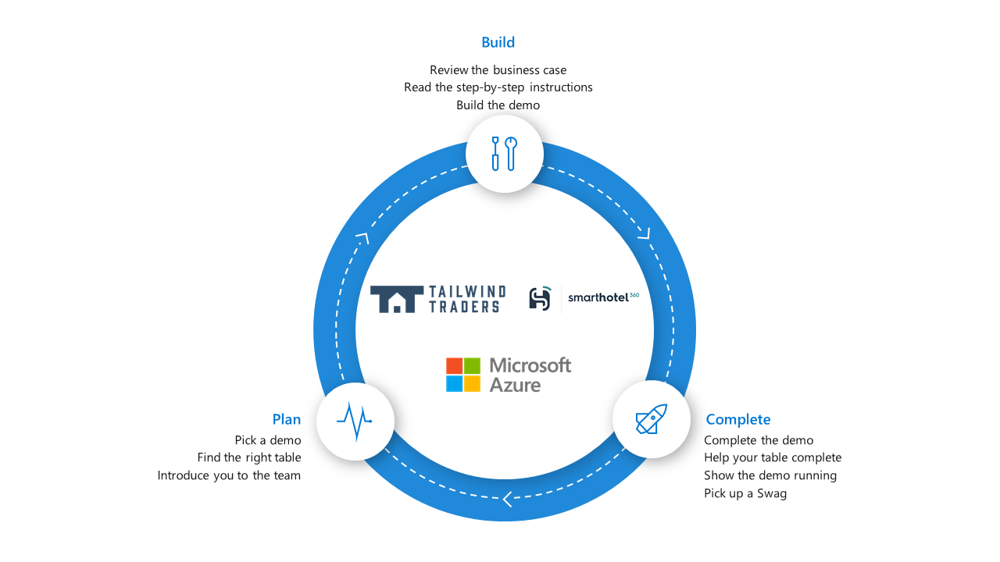
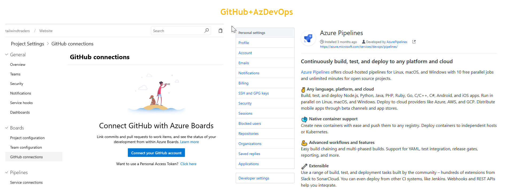
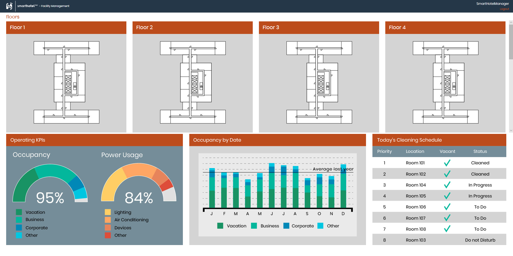

# AI-APP-TS325: Utilizing robust Azure demos for real-world common scenarios

From App Service to AKS, Logic Apps to Functions, Cosmos DB to Cognitive Services and IoT, the SmartHotel360 and Tailwind Traders apps highlight both our Azure cloud capabilities, IoT and DevOps offerings. Since Connect(); we've been able to use SmartHotel360 and Tailwind Traders applications source code in a myriad of ways, from showing cloud-native development to demonstrating how customers can migrate to Azure. In this session you'll learn the architecture, components and get some tips on using it for demonstrating Azure, Azure DevOps, Xamarin, and more.

## Game Plan

## Choose your adventure

| Demo​                               | Description​                                                                           | Repository​                         |
|------------------------------------|---------------------------------------------------------------------------------------|------------------------------------|
| [Modernization with App Services](https://github.com/Microsoft/AzureAppsWorkshop#tailwind-traders-modernization-with-app-services)​    | Migrating ASP.NET WebForms App to Azure App Service and modernizing with Serverless. ​ | Tailwind Traders (Rewards)​         |
| [Managing Backend Services with AKS](https://github.com/Microsoft/AzureAppsWorkshop#tailwind-traders-managing-backend-services-with-aks)​ | Run multi-language based microservices on Azure Kubernetes Service. ​                  | Tailwind Traders (AKS)​             |
| [DevOps](https://github.com/Microsoft/AzureAppsWorkshop#tailwind-traders-devops)​                             | Setup continuous automated pipelines from GitHub to Azure.​                            | Tailwind Traders (Website)​         |
| [Cloud-Native](https://github.com/Microsoft/AzureAppsWorkshop#smarthotel360-cloud-native-solutions)​                       | Build a serverless intelligent app powered by Azure.​                                  | SmartHotel360 (Sentiment Analysis)​ |
| [Internet of Things](https://github.com/Microsoft/AzureAppsWorkshop#smarthotel360-internet-of-things)​                 | Manage IoT devices with Azure Digital Twins.​                                          | SmartHotel360 (IoT)​                |

-------------------------
# Tailwind Traders – Modernization with App Services
 
Tailwind Traders has an existing ASP.NET Framework app that they need to move to the cloud. They also want to take advantage of a rewards program they built in but didn’t have time to implement. In this walkthrough, we’ll take an on-premises ASP.NET Web Form app & SQL DB and migrate it to Azure; then modernize the app to support our new rewards program.
 
**Source code:** https://github.com/Microsoft/TailwindTraders-Rewards

**Demo Script:** 

-------------------------
# Tailwind Traders – Managing Backend Services with AKS

Tailwind Traders would like to take advantage of microservices, as containers in Kubernetes to increase latency of their application and features such as auto-patching, auto-scaling and updates support. Using AKS, they will take advantage of Dev Spaces capabilities to get a great inner loop development experience with Kubernetes on Azure, and save money using our new Virtual Node service.

**Source code**: [https://github.com/Microsoft/TailwindTraders-Backend](https://github.com/Microsoft/TailwindTraders-Backend)

**Demo Script**: [Managing backend with Azure Kubernetes Service (AKS)](https://github.com/Microsoft/TailwindTraders/tree/master/Documents/DemoScripts/Managing%20backend%20with%20Azure%20Kubernetes%20Service%20(AKS))

-------------------------
# Tailwind Traders – DevOps

The Tailwind Traders team uses GitHub for hosting their source code and use Azure Pipelines for continuous integration and continuous delivery to quickly deploy their changes to Azure. Their public website will be hosted in Azure, and they want to automate the entire process so that they can spin up all the infrastructure needed to deploy and host the application without any manual intervention.

Tailwind Traders team, like most DevOps teams practices continuous planning. They connect Azure Boards with their GitHub repositories to take advantage of the rich project management capabilities provided by Azure Boards that spans Kanban boards, backlogs, team dashboards, and custom reporting, etc.,

**Source code:** [https://github.com/Microsoft/TailwindTraders-Website](https://github.com/Microsoft/TailwindTraders-Website)

**Demo Script:** 

-------------------------
# SmartHotel360 – Cloud Native Solutions

SmartHotel360 has implemented a simple Node.js website to analyze customer sentiment from Twitter by using Text Analysis Cognitive Services APIs. This website was built with Visual Studio Code and we used multiple of our newest extensions for Cosmos DB, App Service, Azure Functions, and Docker for Visual Studio Code and Azure to build this app.

**Source code:** [https://github.com/Microsoft/SmartHotel360-SentimentAnalysis](https://github.com/Microsoft/SmartHotel360-SentimentAnalysis)

**Demo script:** 

-------------------------
# SmartHotel360 – Internet of Things

SmartHotel360 has implemented a Hotel Management solution built on top of Azure Digital Twins. The goal of the solution is to generate critical insights from the hotel to optimize building and energy efficiency, improve occupant experience and productivity of hotel personnel.

This solution empowers both the Occupant and the Hotel employees (from Head of Operations to Managers) to control and remotely change settings of rooms, as well as ensure the hotel is always operating to its maximum efficiency. The system is built using Microsoft Azure Digital Twins, PowerBI and utilizes Machine Learning to maximize the impact of the data collected over time.

**Source code:** [https://github.com/Microsoft/SmartHotel360-IoT](https://github.com/Microsoft/SmartHotel360-IoT)

**Demo script:** 

