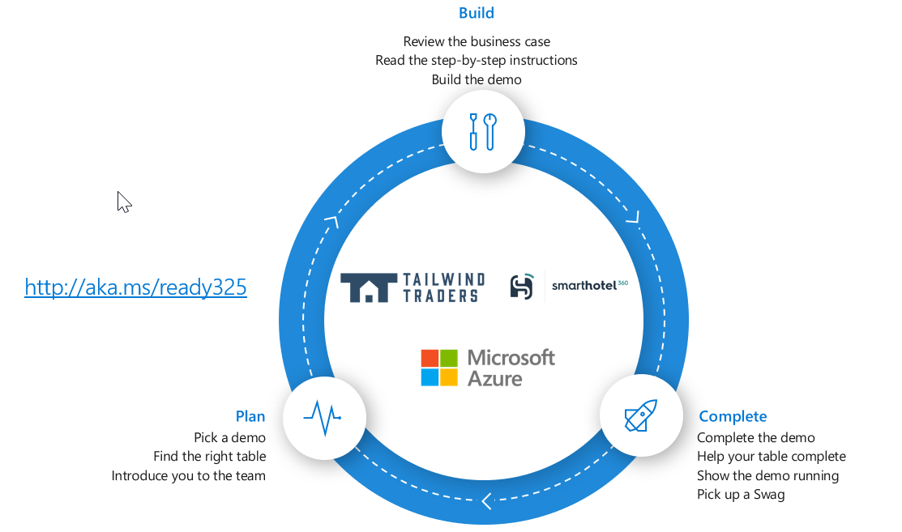

# AI-APP-TS325: Utilizing robust Azure demos for real-world common scenarios

From App Service to AKS, Logic Apps to Functions, Cosmos DB to Cognitive Services and IoT, the SmartHotel360 and Tailwind Traders apps highlight both our Azure cloud capabilities, IoT and DevOps offerings. Since Connect(); we've been able to use SmartHotel360 and Tailwind Traders applications source code in a myriad of ways, from showing cloud-native development to demonstrating how customers can migrate to Azure. In this session you'll learn the architecture, components and get some tips on using it for demonstrating Azure, Azure DevOps, Xamarin, and more. 

## Game Plan:

**Want more swag:** Repeat steps 1-7 with a different demo

## Choose your adventure

| Demo​                               | Description​                                                                           | Repository​                         |
|------------------------------------|---------------------------------------------------------------------------------------|------------------------------------|
| Modernization with App Services​    | Migrating ASP.NET WebForms App to Azure App Service and modernizing with Serverless. ​ | Tailwind Traders (Rewards)​         |
| Managing Backend Services with AKS​ | Run multi-language based microservices on Azure Kubernetes Service. ​                  | Tailwind Traders (AKS)​             |
| [DevOps](./DevOps/)​                             | Setup continuous automated pipelines from GitHub to Azure.​                            | Tailwind Traders (Website)​         |
| Cloud-Native​                       | Build a serverless intelligent app powered by Azure.​                                  | SmartHotel360 (Sentiment Analysis)​ |
| Internet of Things​                 | Manage IoT devices with Azure Digital Twins.​                                          | SmartHotel360 (IoT)​                |

# Contributing

This project welcomes contributions and suggestions.  Most contributions require you to agree to a
Contributor License Agreement (CLA) declaring that you have the right to, and actually do, grant us
the rights to use your contribution. For details, visit https://cla.microsoft.com.

When you submit a pull request, a CLA-bot will automatically determine whether you need to provide
a CLA and decorate the PR appropriately (e.g., label, comment). Simply follow the instructions
provided by the bot. You will only need to do this once across all repos using our CLA.

This project has adopted the [Microsoft Open Source Code of Conduct](https://opensource.microsoft.com/codeofconduct/).
For more information see the [Code of Conduct FAQ](https://opensource.microsoft.com/codeofconduct/faq/) or
contact [opencode@microsoft.com](mailto:opencode@microsoft.com) with any additional questions or comments.

# Legal Notices

Microsoft and any contributors grant you a license to the Microsoft documentation and other content
in this repository under the [Creative Commons Attribution 4.0 International Public License](https://creativecommons.org/licenses/by/4.0/legalcode),
see the [LICENSE](LICENSE) file, and grant you a license to any code in the repository under the [MIT License](https://opensource.org/licenses/MIT), see the
[LICENSE-CODE](LICENSE-CODE) file.

Microsoft, Windows, Microsoft Azure and/or other Microsoft products and services referenced in the documentation
may be either trademarks or registered trademarks of Microsoft in the United States and/or other countries.
The licenses for this project do not grant you rights to use any Microsoft names, logos, or trademarks.
Microsoft's general trademark guidelines can be found at http://go.microsoft.com/fwlink/?LinkID=254653.

Privacy information can be found at https://privacy.microsoft.com/en-us/

Microsoft and any contributors reserve all others rights, whether under their respective copyrights, patents,
or trademarks, whether by implication, estoppel or otherwise.
