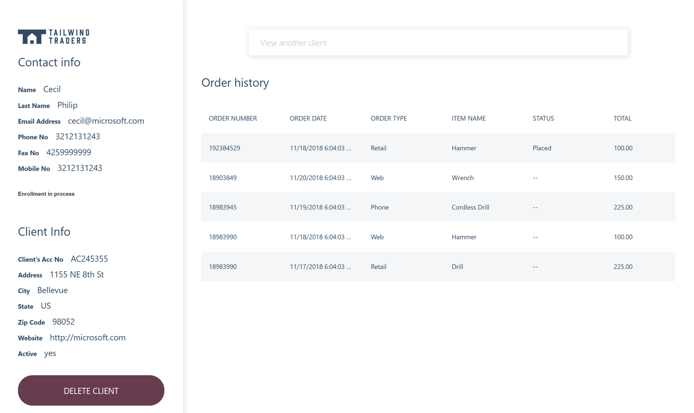

 
# Tailwind Traders – ASP.NET App Modernization 
 
Tailwind Traders has an existing ASP.NET Framework app that they need to move to the cloud. They also want to take advantage of a rewards program they built in but didn’t have time to implement. In this walkthrough, we’ll take an on-premises ASP.NET Web Form app & SQL DB and migrate it to Azure; then modernize the app to support our new rewards program 
 
 
Source code: https://github.com/Microsoft/TailwindTraders-Rewards 

